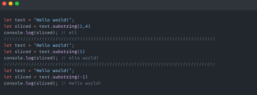

# JavaScript
## Table of Contents:
# 1.String
# 2.Numbers
# What is a Method in JAvaScript?
## JS methodho amalhoe meboshand ki metavonand dar objectho ijro shavand va dar vaqti faryod kardanash kor mekunad
# Creating string in JavaScript:
# 1. 2 kavichka ""
# 2. 1 kavichka ''
# 3. obratniye kavichki ``

# String Methodhoi JavaScript:

# charAt() bo vositai index elmenti moro harfashro mebarorad:

# at() misli charAt() ast lekin in adadi minusaro sraza qabul mekunad:
# concat() 2 va yo ziyoda string-ro yakjoya kunad:

# replace() stringi moro bo tamoman digar string aliw mekunad:

# replaceAll() az replace() bo ivaz kardani 2 va yo ziyoda string farq dorad:

# split() vaqte faryod karda meshavad strokai stringi moro ba massiv megardonad 

# substring() method az start to endi ki mo metem(indexhoi stringi mo)mebarorad!:

# slice() method misli substring()  ast va minusaro qabul mekunad:

# toLowerCase() hamai stringi moro yo strokai moro harfhoyashonro mayda mekunad:

# toUpperCase() hamai stringi moro yo strokai moro harfhoyashonro kalon mekunad:

# trim() method extra space hoi stringi moro delete mekunad:

# includes() method agar dar stringi mo digar string boshad dar danunash rue mebarorad else false:

# toString() method variablei moro ba string megardonad masalan numberro:

# indexOf() method dar daarunash harfi stringi moro megirad va indexi hamon harfro mebarorad:

# repeat() method kadom stringi moro dihem chand bore ki mo meguyem barovarda metihad:

# Math.floor() ba butuni khurdtarini oyanda barobar mekunad:

# Math.round() agar adad az 0.5 ziyod boshad in method raqami moro ba raqami oyandai kalontarin barobar mekunad ,else rakami moro kam mekunad 1 to:

# Math.ceil() novobasta az azdah yo butun raqami moro ba intigeri oyandai kalontarinash barobar mekunad:

# max() maximum numberi dodagii moro meyobad va nishon medihad:

# min() minimum numberi didagii moro meyobad va nishon medihad:

# pow() yagon raqamro dar darajai yagon raqami digar mebardorad:

# sqrt() reshai adadro ba mo medihad:

# abs() minusaro pilusa mekunad luboy minus raqama:

# random() ba chande in methodro zarb zanem to hamon raqam randon value ba momedihad:

# isNaN() mesanjad ki raqami mo NaN ast yo ne(true or false):

